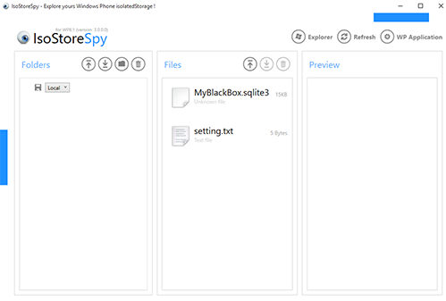

### Tommy Parts for my blackbox project

### the screen shot

### developed device
#Microsoft Lunima 635 (Windows phone 8.1)

### installed software package
#SQLite for Windows Phone 8.1
#Microsoft LuminaSensorCoreSDK v.1.1.1.1
#SQLiteNetExtentions v.1.3.0
#SQLiteNETExtension.Async v1.3.0
#SQLite.Net.Async-PLC v3.1.1
#SQLite.Net.Core-PCL v3.1.1
#SQLite.Net-PCL v3.0.5
#WinRTXamlToolKit.Controls.DataVisualizator v.1.8.1

### required sample data
#MyBlackBox.sqlite3
#setting.txt

#written: 09/March/2016
#s00141425 Tommy Kang